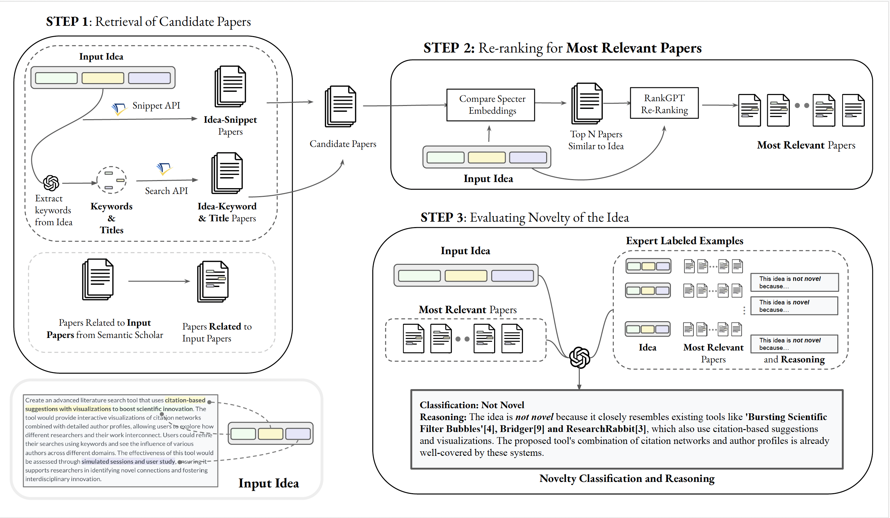

# Scientific Idea Novelty Evaluation

Automated scientific idea generation systems have made remarkable progress, yet the automatic evaluation of idea novelty remains a critical and underexplored challenge. Manual evaluation of novelty through literature review is labor-intensive, prone to error due to subjectivity, and impractical at scale. To address these issues, we propose the **Idea Novelty Checker**, an LLM-based retrieval-augmented generation (RAG) framework that leverages a two-stage  retrieve-then-rerank approach. The **Idea Novelty Checker** first collects a broad set of relevant papers using keyword and snippet-based retrieval, then refines this collection through embedding-based filtering followed by facet-based LLM re-ranking. It incorporates expert-labeled examples to guide the system in comparing papers for novelty evaluation and in generating literature-grounded reasoning. This repository includes both the AI Scientist's novelty checker and our custom **Idea Novelty Checker** implementation. 

[Read the paper here!](assets/paper.pdf)




## Setup Instructions

### Option 1: Using Conda

1. **Create the Environment:**  
   Generate the environment from the `environment.yml` file:
   ```bash
   conda env create -f environment.yml
   ```
2. **Activate the Environment:**  
   ```bash
   conda activate nc_env
   ```

### Option 2: Using pip and virtualenv (or venv)

1. **Create a Virtual Environment:**  
   ```bash
   python3 -m venv nc_env
   ```
2. **Activate the Virtual Environment:**
   ```bash
   source nc_env/bin/activate
   ```
3. **Install Dependencies:**  
   ```bash
   pip install -r requirements.txt
   ```

### Setup Keys and Default Parameters
Add `OPENAI_API_KEY` or `ANTHROPIC_AP_KEY` and `S2_API_KEY` in the config.yml file. 

```bash
python noveltychecker/utils/load_env.py
```

## Example Run

To evaluate the novelty of a given scientific idea using AI Scientist an Idea Novelty Checker, run the following command. 

For example:
```bash
python main.py --idea "Hierarchical Topic Models (HTMs) are useful for discovering topic hierarchies in a collection of documents. However, traditional HTMs often produce hierarchies where lower-level topics are unrelated and not specific enough to their higher-level topics. Additionally, these methods can be computationally expensive. We present HyHTM - a Hyperbolic geometry based Hierarchical Topic Models - that addresses these limitations by incorporating hierarchical information from hyperbolic geometry to explicitly model hierarchies in topic models. Experimental results with four baselines show that HyHTM can better attend to parent-child relationships among topics. HyHTM produces coherent topic hierarchies that specialize in granularity from generic higher-level topics to specific lower-level topics. Further, our model is significantly faster and leaves a much smaller memory footprint than our best-performing baseline. We have made the source code for our algorithm publicly accessible." --papers "220046811, 267211735" --save_path <enter save path here> 
```

### Parameters
- **use_retrieval** (`bool`, default=`True`)  
  The system retrieves papers related to your idea using both semantic scholar's snippet and keyword searches. Once all the papers are collected, these papers are reranked using an embedding-based method (SPECTER-2) followed by an LLM-based reranker (rankGPT). 

- **papers** (`str`)  
  A comma-separated list of paper IDs (optional). Use this parameter to specify additional papers that you want to ensure are included in the novelty evaluation.

- **ablation** (`bool`, default=`False`)  
  When set to `True`, the novelty evaluation is performed for each paper collection & ordering method separately (snippet-only, keyword-only, embedding-only, and the combined embedding + rankGPT approach). By default, the papers are first collected using snippet and keyword search and any additional papers the user provides. These papers are reranked by embedding-based method (SPECTER-2) followed by an LLM-based reranker (rankGPT). 


### Idea Novelty Checker config

This configuration file (`config.yml`) defines key parameters for retrieving papers, ranking relevance with RankGPT, and evaluating idea novelty.

#### Retrieval Settings
- QUERY_RETRIEVAL_METHOD (default: `"keyword+title+snippet"`)  
  Determines the strategy for retrieving relevant papers based on your input idea. Options:
  - `"snippet"`: Retrieves literature snippets and corresponding papers with similar claims using Semantic Scholar's snippet API.
  - `"keyword+title"`: Uses an LLM (`DEFAULT_MODEL`) to extract keywords and titles from the idea, then fetches papers using Semantic Scholar's query search API.
  - `"keyword+title+snippet"`: Combines both approaches.

#### RankGPT Settings
- RANKGPT_VARIANT (default: `"priority"`)  
  Defines how RankGPT measures the relevance of a paper to the idea. Options:
  - `"base"`: Evaluates general relevance (same as original codebase of rankGPT: [code](https://github.com/sunnweiwei/RankGPT)).
  - `"purpose"`: Focuses on matching the primary purpose between the idea and the paper.
  - `"priority"`: Compares multiple idea facets—such as purpose, mechanism, evaluation, and application—with those in the paper.  
  *Default is `"priority"`.*

- RANKGPT_MODEL (default: `"gpt-4o"`)
- RANKGPT_TEMPERATURE (default: `0`)

#### Novelty Checker Settings
- NOVELTY_CHECK_TOPkPapers (default: `10`)  
  Specifies the number of top-ranked papers that the final novelty checker prompt will evaluate.
- NOVELTY_CHECK_MODEL (default: `"o3-mini"`)
- NOVELTY_CHECK_TEMPERATURE (default: `0`)
- NOVELTY_CHECK_PROMPT (default: `"relaxed"`)  
- NOVELTY_CHECK_EXAMPLES (default: `"relaxed"`)

#### Other Settings
- DEFAULT_MODEL (default: `"gpt-4o"`)  
  Used for keyword/title generation from the idea and for extracting idea facets in the RankGPT step.
- DEFAULT_TEMPERATURE (default: `0`)
- STYLE_CHANGE_MODEL (default: `"o3-mini"`)  
  This is not part of the novelty checker. It allows users to adjust the input idea style, similar to the in-context examples provided in our novelty prompt. You can select any model of your choice.

## Contributing

Contributions are welcome! If you encounter any issues or have ideas for improvement, please open an issue or submit a pull request.

---

